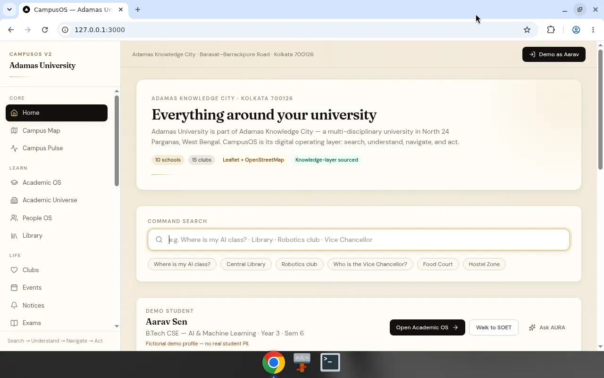

<p align="center">
  
</p>

<h1 align="center">CampusOS — Adamas University</h1>

<p align="center"><strong>Everything around your university, one intelligent operating layer.</strong></p>

<p align="center">
  SEARCH → UNDERSTAND → NAVIGATE → ACT
</p>

<p align="center">
  <a href="https://github.com/SK090347/CampusOS-Adamas/releases"></a>
  <a href="https://github.com/SK090347/CampusOS-Adamas"></a>
  <a href="https://github.com/SK090347/CampusOS-Adamas"></a>
  
</p>

<p align="center">
  A production-quality digital <em>operating system</em> for
  <a href="https://adamasuniversity.ac.in/">Adamas University</a> /
  Adamas Knowledge City — not a generic college dashboard.
</p>

---

## What it is

CampusOS is the app a modern university student opens in the morning:

| Question | CampusOS answer |
|---|---|
| Where is my next class? | Academic OS + timetable → room → **Walk here** |
| How do I get there? | Topology route on an **OpenStreetMap** campus overlay |
| Who is my faculty / VC? | People OS with source-attributed leadership |
| What happened today? | Notices + Campus Pulse |
| What can I join? | 15 clubs + Find your club |
| Where do I eat / stay / study? | Food · Hostel · Library — in-app |

**North star:** keep the campus inside one product so people don’t bounce across random websites.

## Feature map

- **Home command bar** — natural-language campus search with action cards
- **Digital Campus Map** — Leaflet + OSM, 19+ POIs, Dijkstra walk routes over admin-editable nodes/edges
- **Campus Pulse** — OPEN / CLOSED / BUSY / LIMITED / MAINTENANCE (admin-controlled)
- **Academic OS + Academic Universe** — 10 schools, programmes, timetable
- **People OS** — leadership & directory (public institutional info only)
- **Clubs · Events · Notices · Exams**
- **Library · Hostel · Food · Sports · Research · Innovation · Career · Global · Services**
- **AURA** — university assistant grounded in the structured knowledge DB (says when unverifiable)
- **Admin CMS** — maintain buildings, routes, pulse, content without code changes
- **Accessibility** — large text, contrast, reduced motion, keyboard-friendly shell

## Design system

- Palette: deep **ink** + warm campus **gold/cream**
- Type: **Fraunces** (display) + **DM Sans** (UI)
- Feels like a premium campus mobility product — not Bootstrap CRUD

## Knowledge integrity

Institutional claims carry:

`sourceURL` · `sourceTitle` · `sourceType` · `retrievedAt` · `lastVerified` · `confidence` · `status`

Secondary sources are never presented as official. Conflicts surface as discrepancies.  
Demo student **Aarav Sen** is fictional and labeled. Map coordinates are an **approximate overlay**, not official survey GPS.

## Screenshots

| Home | Map |
|---|---|
|  |  |

## Quick start

```bash
git clone https://github.com/SK090347/CampusOS-Adamas.git
cd CampusOS-Adamas
cp .env.example .env
npm install
npm run db:push && npm run db:seed
npm run dev -- -H 0.0.0.0 -p 3000
```

Open http://localhost:3000 → **Demo as Aarav**  
Admin: `/admin` (see `.env.example`)

### Production

```bash
npm run build
npm start -- -H 0.0.0.0 -p 3000
```

## Stack

`Next.js 14` · `TypeScript` · `Tailwind` · `Prisma` · `SQLite` · `Leaflet` · `OpenStreetMap` · `Zod` · `Jose`

## Project structure

```text
src/app          # App Router pages + API
src/components   # UI, map, shell
prisma/          # schema + seed (10 schools, 15 clubs, map graph, …)
docs/screenshots # README assets
```

## Releases

See **[Releases](https://github.com/SK090347/CampusOS-Adamas/releases)** for versioned builds and notes.

## Author

**Sumit Kumar Ta** · [@SK090347](https://github.com/SK090347)

Built as a portfolio-grade campus OS: geospatial UX + institutional knowledge + product design.

## License

MIT
